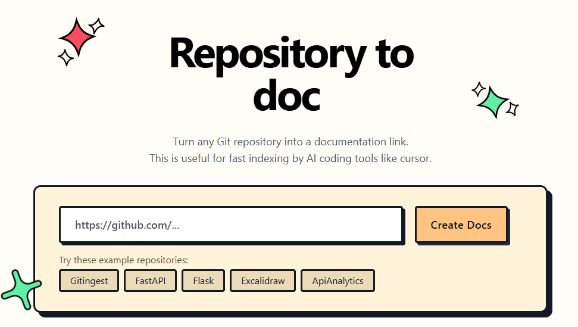

# Gittodoc



[](https://github.com/filiksyos/gittodoc/blob/main/LICENSE)
[](https://github.com/filiksyos/gittodoc)

A tool to convert Git repositories into documentation.

[GitHub Repository](https://github.com/filiksyos/gittodoc)

## 🚀 Features

- **Easy code context**: Get a text digest from a Git repository URL or a directory
- **Smart Formatting**: Optimized output format for documentation
- **Statistics about**:
  - File and directory structure
  - Size of the extract
  - Token count

## 📚 Requirements

- Python 3.7+

## ⚡ Installation & Running

You can install and run Gittodoc using pip and requirements.txt or Docker:

```bash
# Install dependencies
pip install -r requirements.txt

# Or run with Docker Compose
docker-compose up -d
```

> **Note:** Please use the Docker method or clone the repository and run locally as the app is not published on PyPI.

## 🛠️ Stack

- [Tailwind CSS](https://tailwindcss.com) - Frontend
- [FastAPI](https://github.com/fastapi/fastapi) - Backend framework
- [Jinja2](https://jinja.palletsprojects.com) - HTML templating
- [tiktoken](https://github.com/openai/tiktoken) - Token estimation

---

## ⚠️ Note

This app is an experimental fork from [gitingest](https://github.com/cyclotruc/gitingest). As a result, the project structure, folder names (some still called `gitingest`), and documentation are not yet fully updated or comprehensive. Improvements will be made over time.
